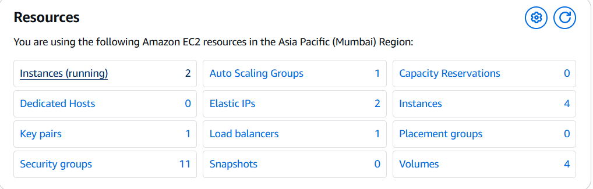

# 🚀 Automate the Infrastructure using Terraform

This project demonstrates how to provision a **production-ready AWS infrastructure** using Terraform with best practices.

---

## 🧱 Architecture Overview

* Multi-AZ VPC setup
* Public & Private subnets
* Internet Gateway + NAT Gateway
* Application Load Balancer (ALB)
* Auto Scaling Group (ASG) with Launch Template
* RDS MySQL (Multi-AZ)
* Read Replica for high availability
* Security Groups for controlled access

---

## 🛠️ Tech Stack

* Terraform
* AWS (EC2, VPC, ALB, RDS, Auto Scaling)
* Linux (WSL/Ubuntu)

---

## 📂 Project Structure

```
.
├── provider.tf
├── vpc.tf
├── subnet.tf
├── igw.tf
├── route-table.tf
├── security-group.tf
├── alb.tf
├── autoscaling.tf
├── rds.tf
└── outputs.tf
```

---

## ⚙️ How to Use

### 1️⃣ Initialize Terraform

```bash
terraform init
```

### 2️⃣ Validate Configuration

```bash
terraform validate
```

### 3️⃣ Plan Infrastructure

```bash
terraform plan
```

### 4️⃣ Apply Changes

```bash
terraform apply
```

---

## 🌐 Features

✔️ High availability using Multi-AZ
✔️ Auto Scaling for dynamic traffic handling
✔️ Load balancing with ALB
✔️ Secure private networking
✔️ Database replication with Read Replica

---

## 🧠 Key Learnings

* Infrastructure as Code (IaC) using Terraform
* AWS networking (VPC, subnets, routing)
* Load balancing and scaling strategies
* RDS configuration and replication
* Debugging real-world Terraform errors

---

## 📸 Screenshots



---

## 👨‍💻 Author

**Vipul Talele**

---

## ⭐ Future Improvements

* Add CI/CD pipeline (GitHub Actions)
* Add Bastion Host for secure SSH
* Implement monitoring (CloudWatch)
* Add HTTPS with ACM

---
